<div align="center">

# Pixeldoll

Build a pixel character and take it across Neorgon

[![Live][badge-site]][url-site]
[![HTML5][badge-html]][url-html]
[![CSS3][badge-css]][url-css]
[![JavaScript][badge-js]][url-js]
[![Claude Code][badge-claude]][url-claude]
[![License][badge-license]](LICENSE)

[badge-site]:    https://img.shields.io/badge/live_site-0063e5?style=for-the-badge&logo=googlechrome&logoColor=white
[badge-html]:    https://img.shields.io/badge/HTML5-E34F26?style=for-the-badge&logo=html5&logoColor=white
[badge-css]:     https://img.shields.io/badge/CSS3-1572B6?style=for-the-badge&logo=css3&logoColor=white
[badge-js]:      https://img.shields.io/badge/JavaScript-F7DF1E?style=for-the-badge&logo=javascript&logoColor=black
[badge-claude]:  https://img.shields.io/badge/Claude_Code-CC785C?style=for-the-badge&logo=anthropic&logoColor=white
[badge-license]: https://img.shields.io/badge/license-MIT-404040?style=for-the-badge

[url-site]:   https://pixeldoll.neorgon.com/
[url-html]:   #
[url-css]:    #
[url-js]:     #
[url-claude]: https://claude.ai/code

</div>

---

## Overview

Pixeldoll builds a 16x16 pixel character part by part: kind (person, cat, dog, robot, and two you have to find), hair, eyes, face, outfit, head, extras, a held item, a pet, and colours. Save it as **your character** and every Neorgon site that draws people (Floorplan first) can use it; copy it as a code or a link to share or to put on someone else's seat. Rare and legendary parts unlock by doing things, and the unlocks follow you across the fleet.

**Live:** pixeldoll.neorgon.com

---

## Features

- **Wardrobe** -- nine slots, 62 parts, drawn live on your character so you see the combination, not a swatch
- **Colours** -- six skins, ten hair colours, six coats, any shirt
- **My character** -- one click saves it to a `*.neorgon.com` cookie; Floorplan offers "Use my character" and walks as it in Visit mode
- **Codes and links** -- `neoav1:...` codes, `#c=` links that open here, PNG at 64 or 256
- **Secrets** -- six unlocks (a shuffle streak, a named save, an old console code, three words) gate rare and legendary parts in the picker; nothing gates rendering
- **Shared engine** -- the same vendored Neorgon Avatar Kit Floorplan uses, so a character looks identical on both sites

---

## Running locally

ES modules require an HTTP server (not `file://`):

```bash
make serve
```

Or manually:

```bash
python3 -m http.server 8869
```

---

## Architecture



```
pixeldoll-site/
├── index.html              # studio: preview, wardrobe, secrets
├── llms.txt                # spec, code format, cookies, unlocks for agents
├── css/
│   └── style.css           # studio layout over the fleet tokens
├── js/
│   ├── app.js              # entry: draft, #c= links, render
│   ├── state.js            # draft spec + name, localStorage, my-character cookie
│   ├── render.js           # hero, tabs, tiles, colours, actions, secrets
│   ├── events.js           # clicks, inputs, Konami, unlock celebrations
│   ├── wardrobe.js         # unlock ids, hints, triggers
│   ├── export.js           # code, link, PNG, #c= parsing
│   ├── neorgon-avatar.js   # vendored Neorgon Avatar Kit (do not edit; sync-avatar.sh)
│   └── neorgon-dom.js      # vendored DOM kit
└── README.md
```

---

<div align="center">
<sub>Part of <a href="https://neorgon.com/">Neorgon</a></sub>
</div>
